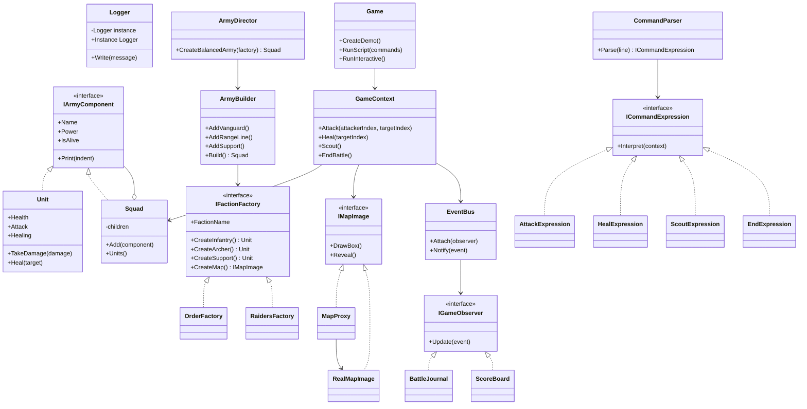
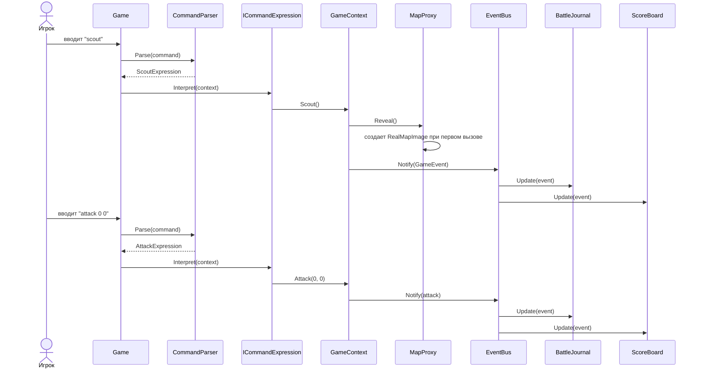

# Отчет по лабораторным работам 7-8

## Тема

Разработка работающей игры на статически типизированном языке программирования с применением паттернов проектирования, изученных в лабораторных работах 1-6.

## Цель работы

Разработать пошаговую стратегию на C#, применив несколько паттернов проектирования в комплексе, подготовить UML-диаграммы классов и последовательности, а также распределить работы между участниками команды.

## Выбранная игра

Разработана оконная пошаговая стратегия `Pattern Quest` на WinForms.

Игрок управляет армией фракции `Орден Севера` и сражается с армией `Налетчики Пустоши`. Армии состоят из отрядов: авангард, дальний ряд, поддержка. Игрок использует кнопки окна, а внутри программы эти действия преобразуются в команды мини-языка:

- `scout` - разведка карты;
- `attack <номер_своего> <номер_врага>` - атака;
- `heal <номер_своего>` - лечение союзника;
- `end` - завершение боя.

Исходный код расположен в файле [Program.cs](C:/Users/roman/pin12-VM/Dev/game/PatternQuest/Program.cs).

## Примененные паттерны из лабораторных работ 1-6

| ЛР | Паттерн | Реализация в проекте |
| --- | --- | --- |
| 1 | Singleton | `Logger` - единый журнал игровых сообщений. |
| 1 | Abstract Factory | `IFactionFactory`, `OrderFactory`, `RaidersFactory` создают совместимые семейства юнитов и карту фракции. |
| 2 | Builder | `ArmyBuilder` и `ArmyDirector` собирают армию из отрядов. |
| 3 | Composite | `IArmyComponent`, `Unit`, `Squad` позволяют одинаково работать с отдельным юнитом и составным отрядом. |
| 4 | Proxy | `MapProxy` откладывает создание `RealMapImage` до команды разведки. |
| 5 | Interpreter | `CommandParser` и выражения `AttackExpression`, `HealExpression`, `ScoutExpression`, `EndExpression` интерпретируют команды игрока. |
| 6 | Observer | `EventBus`, `BattleJournal`, `ScoreBoard` получают уведомления о ходе боя. |

## Диаграмма классов



## Диаграмма последовательности



## Распределение ролей в команде из 3 человек

| Участник | Роль | Что выполнял |
| --- | --- | --- |
| Рома | Архитектор и аналитик | Изучил задания лабораторных 1-8, выбрал жанр пошаговой стратегии, описал игровые сущности, распределил паттерны по зонам ответственности, подготовил UML-диаграмму классов. |
| Люда | Разработчик игровой логики | Реализовала C#-код игры: создание фракций, сборку армий, составные отряды, расчет атаки и лечения, обработку победы и демонстрационный сценарий. |
| Снежана | Разработчик интерфейса и тестировщик | Реализовала интерпретатор команд игрока, журнал событий, счетчик действий, проверила запуск игры, подготовила результат выполнения и оформила отчет. |

## Результат выполнения программы

Команда сборки оконной версии на текущей машине:

```powershell
C:\Windows\Microsoft.NET\Framework64\v4.0.30319\csc.exe /nologo /target:winexe /r:System.Windows.Forms.dll /r:System.Drawing.dll /out:PatternQuest\PatternQuestWin.exe PatternQuest\Program.cs
```

Команда запуска:

```powershell
.\PatternQuest\PatternQuestWin.exe
```

Результат работы: открывается модальное окно `Pattern Quest - лабораторные 7-8` с двумя списками армий, полем состояния карты, кнопками `Разведка`, `Атаковать`, `Лечить`, `Завершить бой` и журналом событий.

Фрагмент журнала:

```text
[LOG] Загрузка реальной карты snow-pass.map
Разведка открыла карту и позиции противника.
> attack 0 0
Страж атакует Берсерк на 8 урона.
Ответный ход: Берсерк атакует Страж.
> heal 2
Целитель лечит Арбалетчик.
> end
Бой завершен по команде игрока.
```

## Вывод

В ходе лабораторных работ 7-8 была разработана работающая оконная пошаговая стратегия на C#. В проекте применены паттерны из лабораторных работ 1-6: Singleton, Abstract Factory, Builder, Composite, Proxy, Interpreter и Observer. Использование паттернов позволило разделить создание объектов, сборку армии, структуру отрядов, обработку команд, ленивую загрузку карты и рассылку игровых событий.
