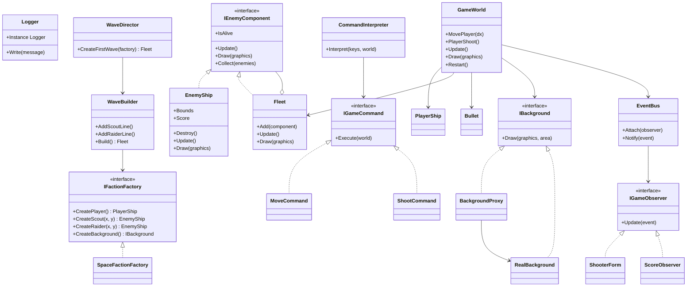
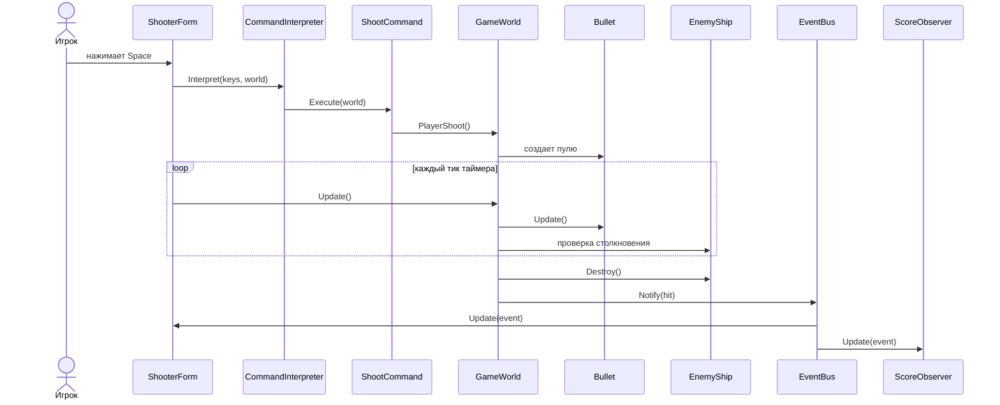

# Отчет по лабораторным работам 7-8

## Тема

Разработка работающей игры на статически типизированном языке программирования с применением паттернов проектирования из лабораторных работ 1-6.

## Цель работы

Разработать активную оконную игру на C# WinForms, применив несколько паттернов проектирования в комплексе, подготовить UML-диаграммы классов и последовательности, а также распределить работу между участниками команды.

## Выбранная игра

Разработана аркадная стрелялка `Pattern Quest Shooter`.

Игрок управляет синим кораблем в нижней части окна. Враги появляются сверху, двигаются по экрану и постепенно опускаются вниз. Игрок двигается клавишами `A/D` или стрелками и стреляет клавишей `Space`.

Победа наступает, когда уничтожена вся волна врагов. Поражение наступает, если здоровье игрока становится равно 0.

Исходный код расположен в файле [Program.cs](C:/Users/roman/pin12-VM/Dev/game/PatternQuest/Program.cs).

## Управление

- `A` или стрелка влево - движение влево.
- `D` или стрелка вправо - движение вправо.
- `Space` - выстрел.
- `R` - рестарт после победы или поражения.

## Примененные паттерны из лабораторных работ 1-6

| ЛР | Паттерн | Реализация в проекте |
| --- | --- | --- |
| 1 | Singleton | `Logger` - единый журнал игровых сообщений. |
| 1 | Abstract Factory | `IFactionFactory`, `SpaceFactionFactory` создают корабль игрока, врагов и фон одной игровой темы. |
| 2 | Builder | `WaveBuilder` и `WaveDirector` собирают волну врагов из нескольких линий. |
| 3 | Composite | `IEnemyComponent`, `EnemyShip`, `Fleet` позволяют одинаково работать с отдельным врагом и составной волной. |
| 4 | Proxy | `BackgroundProxy` откладывает создание тяжелого звездного фона до первого рисования. |
| 5 | Interpreter | `CommandInterpreter`, `MoveCommand`, `ShootCommand` интерпретируют нажатые клавиши как команды игрового мира. |
| 6 | Observer | `EventBus`, `ShooterForm`, `ScoreObserver` получают уведомления о попаданиях, победе, поражении и рестарте. |

## Диаграмма классов



## Диаграмма последовательности



## Распределение ролей в команде из 3 человек

| Участник | Роль | Что выполнял |
| --- | --- | --- |
| Рома | Архитектор и аналитик | Изучил задания лабораторных 1-8, выбрал жанр активной стрелялки, распределил паттерны по зонам ответственности, подготовил UML-диаграмму классов. |
| Люда | Разработчик игровой логики | Реализовала C#-код игрового мира: движение игрока, выстрелы, врагов, столкновения, очки, победу и поражение. |
| Снежана | Разработчик интерфейса и тестировщик | Реализовала WinForms-окно, обработку клавиш, журнал событий, статус игры, проверила запуск и оформила отчет. |

## Результат выполнения программы

Команда сборки на текущей машине:

```powershell
C:\Windows\Microsoft.NET\Framework64\v4.0.30319\csc.exe /nologo /target:winexe /r:System.Windows.Forms.dll /r:System.Drawing.dll /out:PatternQuest\PatternShooter.exe PatternQuest\Program.cs
```

Команда запуска:

```powershell
.\PatternQuest\PatternShooter.exe
```

В Git Bash:

```bash
./PatternQuest/PatternShooter.exe
```

Результат работы: открывается окно `Pattern Quest Shooter - лабораторные 7-8` с игровым полем, кораблем игрока, движущимися врагами, счетом, HP и журналом событий.

Фрагмент журнала:

```text
[LOG] Стрелялка запущена. Управление: A/D или стрелки, Space - выстрел, R - рестарт.
[LOG] Фон уровня загружен через Proxy.
Попадание: уничтожен Разведчик. +10 очков.
[LOG] Попаданий за игру: 1
Победа: вся вражеская волна уничтожена.
```

## Вывод

В ходе лабораторных работ 7-8 была разработана работающая оконная аркадная стрелялка на C#. В проекте применены паттерны Singleton, Abstract Factory, Builder, Composite, Proxy, Interpreter и Observer. Паттерны позволили разделить создание объектов, сборку волны, структуру врагов, обработку клавиш, ленивую загрузку фона и рассылку игровых событий.
